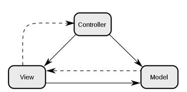

<div align="center">
    
    <h3>
        <b> 표준프레임워크 eGovFrame </b>
    </h3>
    <p>
        <b> 행정안전부 산하 한국정보화진흥원에서 만든 웹 기반 어플리케이션 프레임워크 eGovFrame에 관하여 정리한 문서입니다. 이 외의 프로젝트는 다른 계정(Private)에서 공유 중입니다. </b>
    </p>
</div>


# 📜 Index
### <a href="#indexReferences">📰 참조 사이트</a>
### <a href="#indexInstall">📥 설치 및 실행</a>
### <a href="#indexMVC">♻ MVC 구조</a>
### <a href="#indexVO">📦 VO(Value Object)</a>
### <a href="#indexDatabase">💿 데이터베이스 설정</a>
### <a href="#indexController">🔄 Controller</a>
### <a href="#indexService">➡ Service</a>
### <a href="#indexSQLMapper">🛅 SQL Mapper</a>


# 📰 참조 사이트<a id="indexReferences"></a>
> 전자정부 프레임워크를 학습할 때 참고하면 좋은 사이트를 정리합니다.

[<< 조황섭님 강의 재생목록 >>](https://youtu.be/dfOh9KyUNtU?si=L64OAEyPx0Hk78UK)

조황섭 강사님이 비대면 수업 시에 강의했던 내용이 올라와있는 영상입니다. 전자정부 프레임워크의 기본을 학습할 때에 매우 유용합니다.

[<< 표준프레임워크 포털 기술 지원 >>](https://www.egovframe.go.kr/home/sub.do?menuNo=69)

전자정부 프레임워크의 기술지원 사이트입니다. 모르는 문제에 관하여 질문할 수 있습니다.


# 📥 설치 및 실행<a id="indexInstall"></a>
> 전자정부 프레임워크를 설치하고 환경을 구축하는 방법에 대한 설명입니다.

[<< 표준 프레임워크 개발환경 다운로드 >>](https://www.egovframe.go.kr/home/sub.do?menuNo=39)

표준 프레임워크 포털 사이트의 다운로드 환경을 통해 사용할 버전을 선택하여 설치합니다. 각 버전에 대하여 요구 사항이나 설치 방법은 표준 프레임워크 포털 사이트에 상세히 설명되어있습니다.(jdk 1.8 필요)

설치 후 해당 디렉토리로 이동한 후 전자정부프레임워크의 eclipse를 실행합니다.

<div align="center">

</div>

Open Perspective를 통해 eGovFrame으로 실행합니다. eGovFrame Web Project로 새 프로젝트를 생성합니다.

<div align="center">

</div>

프로젝트 이름과 Group Id를 설정하고 Next를 누른 다음 Generate Example를 체크하고 Finish 버튼을 눌러 프로젝트를 생성합니다.

eclipse 폴더와 workspace 폴더가 있는 eGovFrameDev 폴더에 아파치 톰캣 폴더를 두어 관리한 후 Servers를 통해 서버를 추가합니다.

<div align="center">

</div>

서버에 프로젝트를 추가한 후 서버를 실행시킨 후 정상적으로 작동하는 지 확인합니다.


# ♻ MVC 구조<a id="indexMVC"></a>
> 소프트웨어 설계에서 자주 사용되는 전체적인 디자인 패턴인 MVC 패턴에 관련하여 설명합니다.

<div align="center">

</div>

MVC 패턴은 Model, View, Controller의 세 가지 구성 요소로 프로젝트를 만드는 패턴입니다. 전자정부 프레임워크에서는 이 Spring MVC를 사용합니다.

### 📼 Model
애플리케이션의 정보, 데이터의 흐름을 담당합니다. 대표적 예시로 Service, Impl, DAO 등이 있으며 다음과 같은 규칙이 있습니다.

1. 사용자가 편집하려는 모든 데이터를 가지고 있습니다.

1. View나 Controller에 대해서는 아무것도 알지 못합니다.

1. 변경이 일어난다면 그에 대한 처리 방법을 구현합니다.


### 📺 View
화면 구성 파일입니다. 대표적인 예시로 jsp와 같은 프론트 파일이 있으며, 다음과 같은 규칙이 있습니다.

1. Model이 가지고 있는 정보를 따로 저장하지 않습니다.

1. Model이나 Controller에 대해서는 아무것도 알지 못합니다.

1. 변경이 일어난다면 그에 대한 처리 방법을 구현합니다.


### 🎥Controller
각 Model과 View가 상호 동작할 때 조정하고 흐름을 제어하는 역할을 담당합니다. Controller 파일이 대표적이며 다음과 같은 규칙이 있습니다.

1. Model과 View에 대해서 알고 있습니다.

1. Model이나 View의 변경을 관리합니다.


# 📦 VO(Value Object)<a id="indexVO"></a>
> Model이나 Controller에서 매개변수들을 전달할 때 너무 많아지는 것을 방지하기 위해 이 변수들을 묶어 사용합니다. 이를 VO로 합니다.

src/main/java에 Service 패키지를 생성하고 그 안에 VO에 관한 클래스를 만듭니다.

전달할 매개 변수들을 다룰 멤버들을 private 접근 지정자로 생성합니다. 각 멤버들에 관한 Getter, Setter 메서드를 생성합니다.

이후 Controller나 Model에서 VO를 사용합니다.


# 💿 데이터베이스 설정<a id="indexDatabase"></a>
> 전자정부 프레임워크에서 데이터 베이스에 접근하기 위해서 설정할 요소들을 설명합니다.

### 💾 드라이버 설정(pom.xml)
```xml
    <!-- 오라클 설정 S -->
    <repository>
        <id>codelds</id>
        <url>https://code.lds.org/nexus/content/groups/main-repo</url>
    </repository>
    <!-- 오라클 설정 E -->

    <!-- 오라클 설정 S -->
    <dependency>
        <groupId>commons-dbcp</groupId>
        <artifactId>commons-dbcp</artifactId>
        <version>1.4</version>
    </dependency>
    <dependency>
        <groupId>ojdbc6</groupId>
        <artifactId>ojdbc6</artifactId>
        <version>11.2.0.3</version>
        <scope>system</scope>
        <systemPath>${basedir}/src/main/webapp/WEB-INF/lib/ojdbc6.jar</systemPath>
    </dependency>
    <!-- 오라클 설정 E -->
```

pom.xml 파일은 프로젝트에 Maven Dependencies의 Library를 추가하여 관리하게 해줄 수 있는 파일입니다. 위와 같이 repository와 dependency를 각 맞는 부분에 설정하여 jdbc 드라이버를 설치할 수 있게 합니다.

간혹 오류가 발생하는 경우도 있는데 그러할 경우에는 위와 같이 직접 jar 라이브러리를 다운받아 시스템 경로를 지정해줍니다.


### 📟 DB 접속 설정(context-datasource.xml)
context-datasource.xml 파일에는 데이터 베이스에 접속하기 위한 주소, 아이디, 비밀번호 등을 설정합니다. 각 데이터베이스에 해당하는 주석을 골라 값에 맞게 설정하고 나머지는 주석 처리합니다.


# 🔄 Controller<a id="indexController"></a>
### 📟 dispatcher-servlet
```xml
<bean class="org.springframework.web.servlet.view.UrlBasedViewResolver" p:order="1"
    p:viewClass="org.springframework.web.servlet.view.JstlView"
    p:prefix="/WEB-INF/jsp/egovframework/example/" p:suffix=".jsp"/>
```

dispatcher-servlet에는 다음과 같이 Controller의 메서드 리턴값을 설정하는 부분이 있습니다. 이동할 jsp 파일이 있는 디렉토리를 지정하기 위해서는 p:prefix 값을 변경합니다.


### 📱 Controller 생성
src.main.java에 컨트롤러를 다룰 web 패키지를 만든 다음 Controller 클래스를 생성합니다.

클래스에는 ```@Controller```로 Annotation을 지정해줘야합니다.

컨트롤러의 동작을 수행할 메서드를 생성합니다. 조건은 다음과 같습니다.

1. ```@RequestMapping(value = "/~url이름~.do")```로 매핑 Annotation을 지정해줍니다.

1. public 접근지정자를 지정해야합니다.

1. return 타입은 String으로 지정합니다.

1. 만약 데이터 베이스의 데이터들에 접근한다면 ```throws Exception```으로 예외를 지정해줍니다.

1. return 값으로는 dispatcher-servlet 파일에서 설정한 값 또는 ```redirect:~url이름~.do```로 다른 ```@RequetMapping``` 메서드를 수행합니다.


# ➡ Service<a id="indexService"></a>
> Serivce는 데이터의 흐름을 담당하는 Model입니다. Controller의 매핑 되어 있는 메서드에서 주로 활용되는 메서드를 구현합니다.

### 📄 Service
```java
public interface LoginService {
    UserVO selectUserVo(LoginVO loginVO);
    List<CtsDeptIdVO> selectCtsDeptIdVo(LoginVO loginVO);
    List<MenuVO> selectMenuVo(UserVO userVO);
    int checkIdPassWord(LoginVO loginVO);
}
```

VO가 들어있는 Service 패키지에 생성합니다. 후에 Service 인터페이스 파일을 생성합니다.

Service의 메서드를 생성합니다. 규칙은 다음과 같습니다.

1. 실행할 쿼리문에 따라 return 타입을 지정합니다.
    * String - insert문(성공 시 null값 반환)
    * int - update문, delete문(성공 시 수정/삭제된 레코드 개수 리턴) 또는 select CNT문
    * List - 여러 개의 레코드들을 list 형태로 가져오는 select문
    * VO - 하나의 레코드에 대해 그 레코드의 VO 정보들을 가져오는 select 문

2. 메서드의 이름은 수행하는 쿼리문을 대표하는 이름으로 지정합니다.

3. 만약 메서드가 데이터 베이스의 데이터들에 접근한다면 ```throws Exception```으로 예외를 지정해줍니다.

4. 서비스 메서드의 상세 내용은 SerivceImpl에서 구현하므로 주석으로 어떤 작업이 수행되는 지 설명만 작성합니다.


### 📝 ServiceImpl

```java
@Service("loginService")
public class LoginServiceImpl extends EgovAbstractServiceImpl implements LoginService {
    @Resource(name = "loginMapper")
    private LoginMapper loginMapper;

    @Override
    public UserVO selectUserVo(LoginVO loginVO) {
        return loginMapper.selectUserVo(loginVO);
    }
}
```

서비스를 구현합니다. src.main.java의 impl이라는 패키지를 따로 만들어 관리합니다.

서비스 인터페이스 이름과 일치시키고 뒤에 Impl만 붙인 클래스를 생성합니다.

```java
@Resource(name = "loginService")
private LoginService loginService;
```

```@Service("~서비스 이름~")``` 어노테이션을 지정합니다. 이후 Controller에서 위와 같이 ```@Resource(name="~서비스이름~")``` Annotation을 지정하여 객체를 생성해 사용합니다. 

클래스에 ```extends EgovAbstractServiceImpl```를 통해 전자정부 프레임워크의 기능을 사용할 수 있도록합니다.

클래스에 ```implements ~서비스 이름~```을 통해 서비스 인터페이스를 구현합니다.

이크립스의 기능을 이용하거나 직접 오버라이딩을 구현합니다. return 값으로는 위의 예시와 같이 이 후 제작할 Mapper 클래스의 메서드로 지정합니다.


# 🛅 SQL Mapper<a id="indexSQLMapper"></a>
> SQL Mapper는 서비스에서 직접 데이터 베이스에 접근하여 쿼리문을 수행하는 역할을 합니다. Mapper.xml 파일과 연결하는 메서드 역할을 하는 Mapper.java와 직접적으로 쿼리문을 수행하는 Mapper.xml이 있습니다.

### 🔗 Mapper.java

서비스 패키지 안에서 mybatis 패키지에 ~Mapper이름~Mapper.java의 패키지를 구현합니다.

```java
@Mapper("loginMapper")
public interface LoginMapper {
    public UserVO selectUserVo(LoginVO loginVO);

    public List<CtsDeptIdVO> selectCtsDeptIdVo(LoginVO loginVO);

    public List<MenuVO> selectMenuVo(UserVO userVO);

    public int checkIdPassWord(LoginVO loginVO);
}
```

```java
@Resource(name = "loginMapper")
private LoginMapper loginMapper;
```

```@Mapper("~Mapper이름~")``` 으로 Mapper Annotation을 지정해줍니다. 이 후 impl 파일에서 Resource로 등록하여 객체를 사용할 수 있습니다.

각 메서드들은 impl에서 return 값으로 지정한 메서드들을 생성합니다. 따라서 매개변수와 리턴 타입이 같아야 합니다.


### 📥 Mapper.xml
src/main/resource의 egovframework/sqlmap 부분에 있는 sql-mapper-config.xml 파일을 설정합니다.

```xml
<?xml version="1.0" encoding="UTF-8"?>
<!DOCTYPE configuration PUBLIC "-//mybatis.org//DTD Config 3.0//EN" "http://mybatis.org/dtd/mybatis-3-config.dtd">

<configuration>
    <settings>
        <setting name="mapUnderscoreToCamelCase" value="true"/>
    </settings>

    <typeAliases>
    </typeAliases>

    <!-- myBatis Inteceptor for get column information  -->
    <plugins>
        <plugin interceptor="com.nexacro.uiadapter17.spring.dao.mybatis.NexacroMybatisMetaDataProvider" />
        <plugin interceptor="com.nexacro.uiadapter17.spring.dao.mybatis.NexacroMybatisResultSetHandler" />
    </plugins>
</configuration>
```

위와 같이 package 또는 파일을 설정하여 VO 파일들을 추가합니다.

src/main/resource의 egovframework/sqlmap 부분에 Mapper.xml 파일을 생성합니다.

```xml
<mapper namespace="kr.ac.du.common.service.impl.mybatis.LoginMapper">
<select id="selectUserVo" parameterType="loginVO" resultType="userVO">
    SQL 쿼리 문
</select>
```
mapper 태그를 통해 Mapper.java와 연결시켜줍니다.

쿼리문 태그를 이용하여 쿼리문을 수행합니다. id 값은 Mapper.java의 메서드 이름으로 설정하고 parameterType과 resultType을 sql-mapper-config 파일에서 등록한 typeAliases의 VO들 중 알맞은 VO로 설정합니다.
